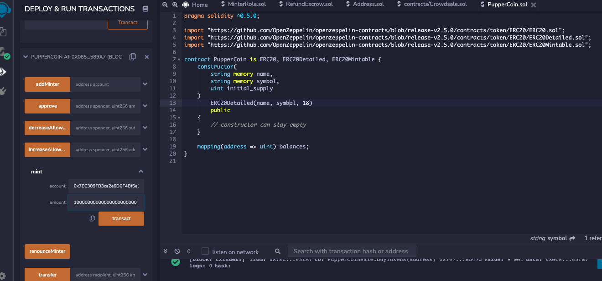
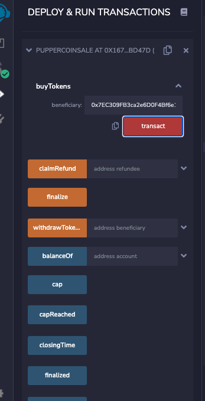
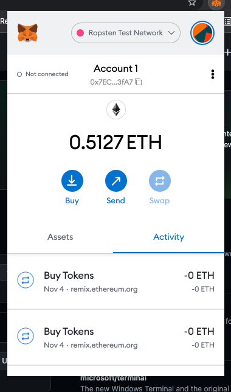
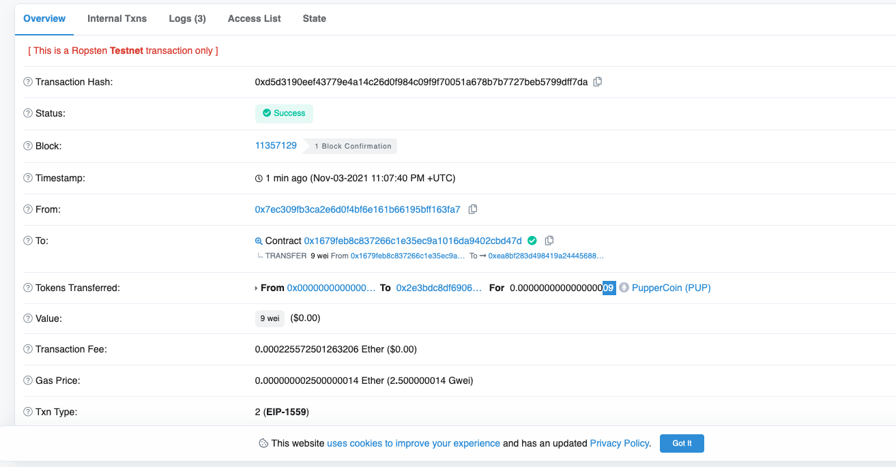

# crowdsale
Advanced Solidity Project

## Use Case.

Your company has decided to crowdsale their PupperCoin token in order to help fund the network development.
This network will be used to track the dog breeding activity across the globe in a decentralized way, and allow humans to track the genetic trail of their pets. You have already worked with the necessary legal bodies and have the green light on creating a crowdsale open to the public. However, you are required to enable refunds if the crowdsale is successful and the goal is met, and you are only allowed to raise a maximum of 300 Ether. The crowdsale will run for 24 weeks.

## Implementation.

Using Remix, we created a file called PupperCoin.sol and a standard ERC20Mintable token. The codes can be looked up following these links.

* [Pupper Coin Contract](PupperCoin.sol)
* [Crowdsale Contract](Crowdsale.sol)

## Deployment.

* Minting PUP coins.

* Deploying Crowdsale (PupperCoinSale) contract

* Buying PUPs to raise the funds.

_Please note, since we are running the contract on a testnet, we are using small numbers and amounts for contract deployment._